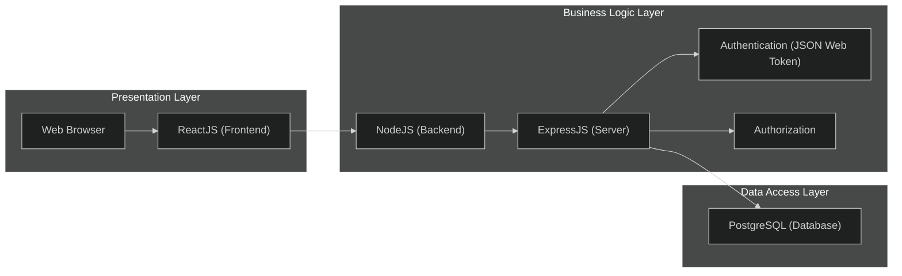
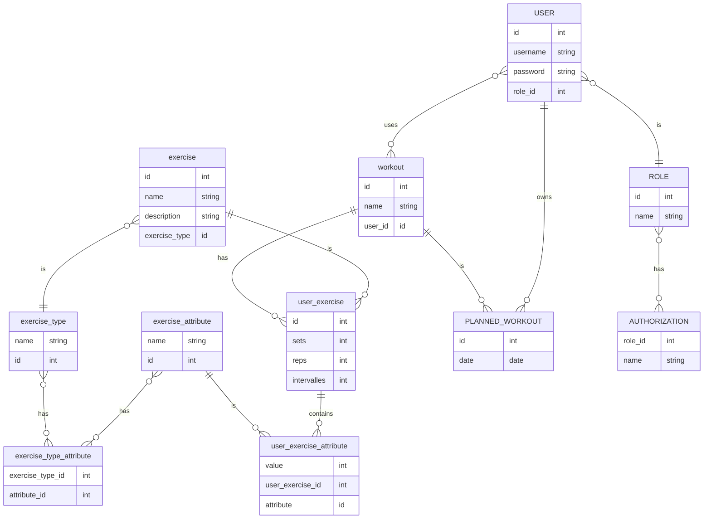
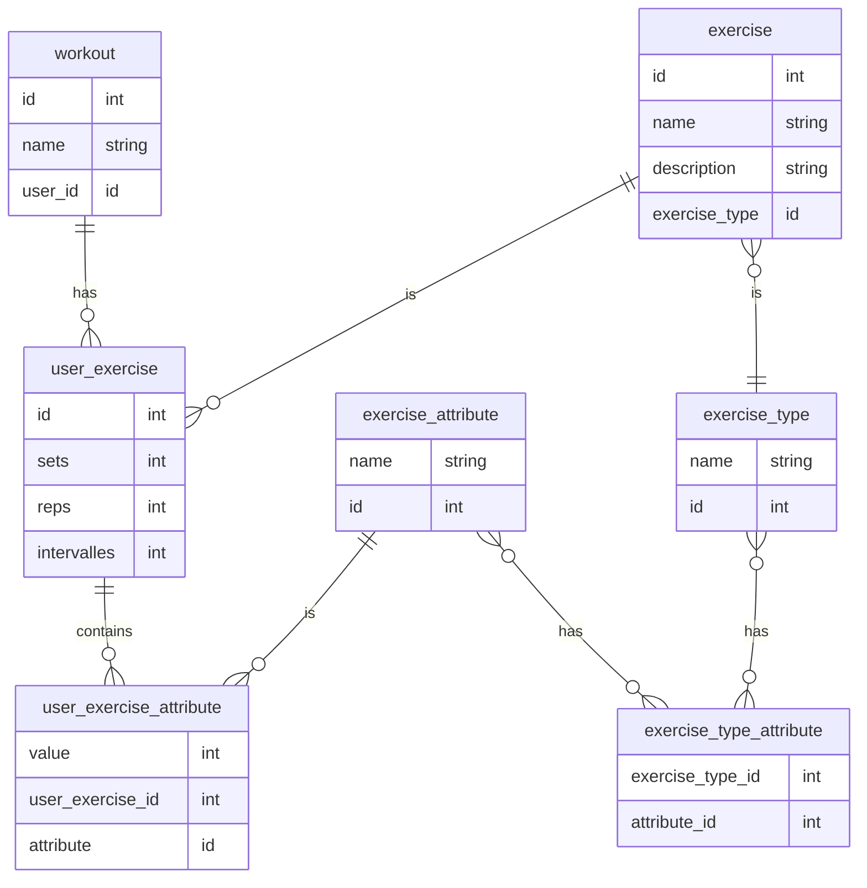

# Xpert Gym Web-app


---

### Backend 

```bash
npm install express sqlite3 typescript cors @types/cors @types/node @types/express @types/node @types/


npm install -D concurrently nodemon
```

### Frontend

- init front end with
`npx create-react-app . --template typescript`


```bash
xpert-app/
│
├── frontend/                 # Frontend
│   ├── src/                  # source files
│   │   ├── components/       # react components
│   │   │   ├── calendar.tsx  # example comps..
│   │   │   └── catalog.tsx
│   │   ├── App.tsx           # main app component
│   │   └── index.tsx         # entry point
│   ├── public/               # static files
│   ├── package.json          # frontend deps.
│   └── tsconfig.json         # typeScript conf. 
│
├── backend/                  # Backend
│   ├── src/                  # source files
│   │   ├── controller/       # server actions
│   │   ├── db/               # db setup
│   │   ├── routes/           # api routes
│   │   ├── services/         # sql queries/returning obj.
│   │   ├── index.ts          # Entry point
│   ├── database.sqlite       # SQLite DB
│   ├── package.json          # Backend dep.
│   └── tsconfig.json         # TypeScript conf.
└── README.md 


```



---

<p>
<details>
<summary>Mermaid ER-diagram</summary>

These details <em>remain</em> <strong>hidden</strong> until expanded.



---



</details>
</p>


---

*This project was created by the following people:*
*- Gabriel Bülow*
*- Isak Ekman*
*- Martin Karlsson*
*- Mohammad Faisal Issaqi*
*- Viktor Alexandersson*
