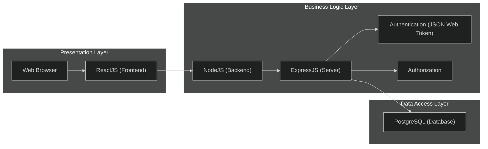
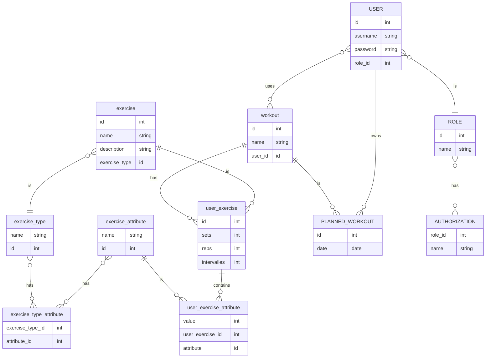
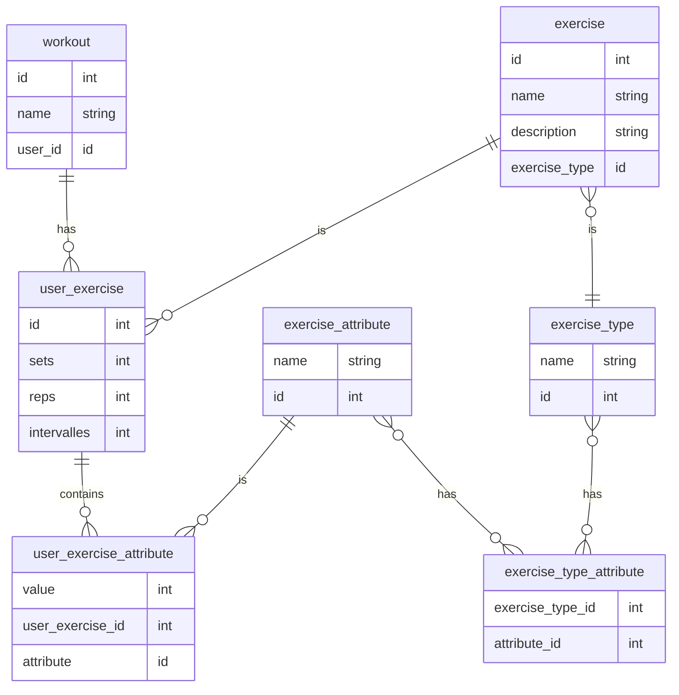

# Xpert Gym Web-app


Öppna två terminaler, gå till `backend` mappen med en och `frontend` med den andra.

Kör dessa script i båda terminalerna:

```bash
npm install # kommer att installera alla dependencies som står i package.json filen

npm run dev # kommer köra dev scriptet som står i package.json filen.
```

<p>
<details>
<summary>package.json dependencies</summary>


`devDependencies` kan ignoreras.

### Backend

```json
  "dependencies": {
    "@types/cors": "^2.8.14",
    "@types/express": "^4.17.18",
    "@types/node": "^20.7.0",
    "@types/sqlite3": "^3.1.9",
    "cors": "^2.8.5",
    "express": "^4.18.2",
    "sqlite3": "^5.1.6",
    "typescript": "^5.2.2"
  },
  "devDependencies": {
    "concurrently": "^8.2.1",
    "nodemon": "^3.0.1"
  }
```

### Frontend

```json

  "dependencies": {
    "react": "^18.2.0",
    "react-dom": "^18.2.0"
  },
  "devDependencies": {
    "@types/react": "^18.2.15",
    "@types/react-dom": "^18.2.7",
    "@typescript-eslint/eslint-plugin": "^6.0.0",
    "@typescript-eslint/parser": "^6.0.0",
    "@vitejs/plugin-react": "^4.0.3",
    "eslint": "^8.45.0",
    "eslint-plugin-react-hooks": "^4.6.0",
    "eslint-plugin-react-refresh": "^0.4.3",
    "typescript": "^5.0.2",
    "vite": "^4.4.5"
  }

```

</details>
</p>


---


```bash
xpert-app/
│
├── frontend/                 # Frontend
│   ├── src/                  # source files
│   │   ├── components/       # react components
│   │   │   ├── calendar.tsx  # example comps..
│   │   │   └── catalog.tsx
│   │   ├── App.tsx           # main app component
│   │   └── LoginPage.tsx         # entry point
│   ├── public/               # static files
│   ├── package.json          # frontend deps.
│   └── tsconfig.json         # typeScript conf. 
│
├── backend/                  # Backend
│   ├── src/                  # source files
│   │   ├── controller/       # server actions
│   │   ├── db/               # db setup
│   │   ├── routes/           # api routes
│   │   ├── services/         # sql queries/returning obj.
│   │   ├── index.ts          # Entry point
│   ├── database.sqlite       # SQLite DB
│   ├── package.json          # Backend dep.
│   └── tsconfig.json         # TypeScript conf.
└── README.md 


```



---

<p>
<details>
<summary>Mermaid ER-diagram</summary>

These details <em>remain</em> <strong>hidden</strong> until expanded.



---



</details>
</p>


ändringar i databasen.

Workout 
  +UserID(fk)   // lättare med join queries
  -planned_date // en workout can ha fler än en dag planerad(?) blev nytt table ist.

User
  ID -> Gym_ID
  +ID (unique)
  +Role_ID (FK)

- (CLIENT COACH ADMIN tables)
+ Role
  Role 
  ID PK


Den är rätt tvetydlig med sina namnen (Has, ConsistOf), så för att slippa gå och kolla på grafen hela tiden dö[tes de om till ]  


Exercise har en composite PK av Workout id och CatalogExercise ID.
Detta gör att man ej kan ha en catalogexercise två eller fler gånger. 
Vill vi detta?


---

*This project was created by the following people:*
*- Gabriel Bülow*
*- Isak Ekman*
*- Martin Karlsson*
*- Mohammad Faisal Issaqi*
*- Viktor Alexandersson*
