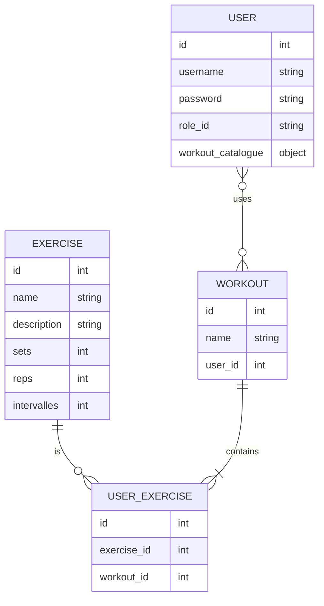

# Xpert Gym Web-app

### What can be broken down into modules?

### What will speak with what?

### Should we use a CRUD backend API?

---

---

This project was created by the following people:

Gabriel Bülow
Isak Ekman
Martin Karlsson
Mohammad Faisal Issaqi
Viktor Alexandersson

